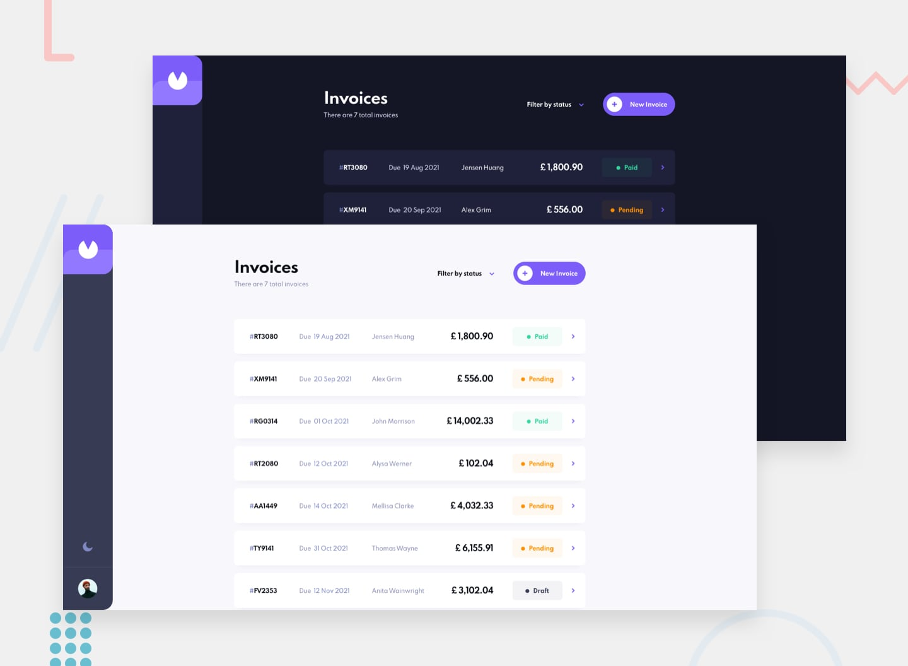

# Frontend Mentor - Invoice App Solution

This is a solution to the [Invoice app challenge on Frontend Mentor](https://www.frontendmentor.io/challenges/invoice-app-i7KaLTQjl). Frontend Mentor challenges help you improve your coding skills by building realistic projects.

## Table of Contents

- [Overview](#overview)
  - [The challenge](#the-challenge)
  - [Screenshot](#screenshot)
  - [Links](#links)
- [My Process](#my-process)
  - [Built with](#built-with)
  - [What I learned](#what-i-learned)
  - [Continued development](#continued-development)
  - [Useful resources](#useful-resources)
- [Author](#author)
- [Acknowledgments](#acknowledgments)

## Overview

### The challenge

Users should be able to:

- View the optimal layout for the app depending on their device's screen size
- See hover states for all interactive elements on the page
- Create, read, update, and delete invoices
- Receive form validations when trying to create/edit an invoice
- Save draft invoices and mark pending invoices as paid
- Filter invoices by status (draft/pending/paid)
- Toggle light and dark mode
- **Bonus**: Keep track of any changes, even after refreshing the browser (localStorage could be used for this if you're not building out a full-stack app)

### Screenshot

Add a screenshot of your solution here.

### Links

- Solution URL: [Add solution URL here](https://github.com/SnezanaL/ng-invoice-app)
- Live Site URL: [Add live site URL here](https://your-live-site-url.com)

## My Process

### Built with

- [Angular](https://angular.io/) - Version 17
- [Tailwind CSS](https://tailwindcss.com/) - For styling
- Semantic HTML5 markup
- Flexbox
- Mobile-first workflow
